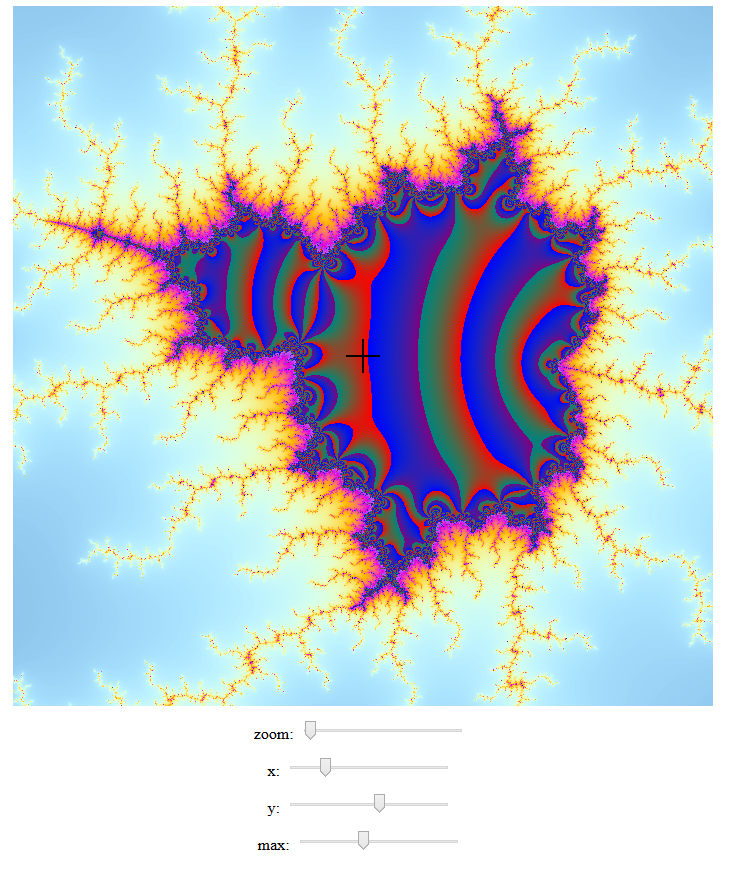

# webGLbrot
This is my first try using webGL.

I mostly dont know what I'm doing.

# If you want to play with it
The task.json has the build tasks for visual studio code, so pressing ctrl-shift-b should run it.
However you must have http-server installed on your system.
This is done fairly easily with:
```
> npm install http-server
```
